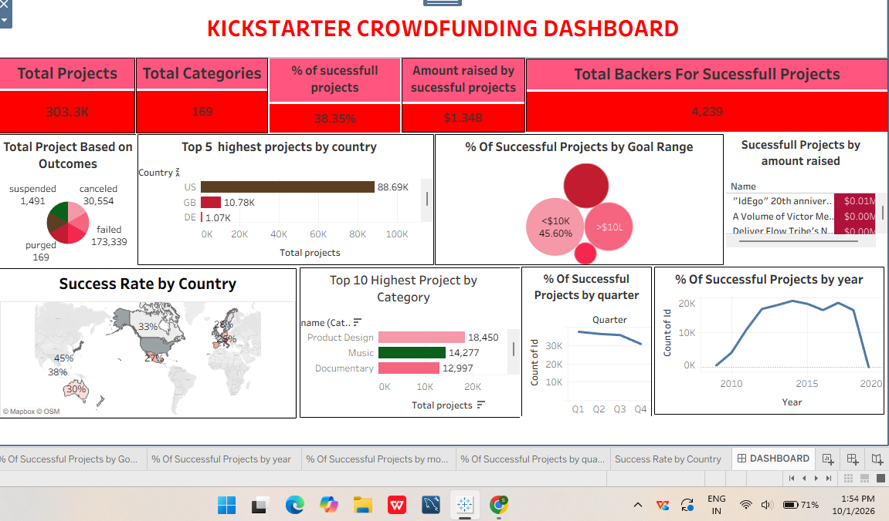

# Kickstarter_Tableau_Dashboard
# Kickstarter Crowdfunding Performance Analysis (Tableau)

## 📌 Project Overview
This data analytics project was completed as part of my formal training coursework. The objective of this analysis was to explore a global Kickstarter crowdfunding dataset containing historical campaign records. By constructing an interactive dashboard, this project evaluates what key factors drive fundraising outcomes, tracking campaign volumes, regional success rates, and category benchmarks to understand crowdfunding market patterns.

## 📊 Dashboard Visualizations
### Global Crowdfunding Performance Dashboard

## 🛠️ Technical Stack & Skills Developed
* **Data Visualization (Tableau):** Applied analytical methods to design a comprehensive business monitoring panel. Formatted high-level KPI cards, interactive geospatial maps, line trend charts, and categorical distribution views.
* **Geographic & Metric Mapping:** Utilized dynamic geographic map layers to track performance ratios across various countries alongside timeline filters to group performance parameters by fiscal quarters and launch years.
* **Data Summarization:** Arranged raw business dimensions to filter out volume metrics, successfully isolating performance statistics across distinct investment categories.

## 💡 Core Metrics & Data Insights
* **Global Campaign Scale:** Successfully monitored a historical database tracking **303.3K total projects** spanning **169 unique categories**, calculating an overall success rate baseline of **38.35%**.
* **Financial Capital Raised:** Evaluated fundraising performance records across global markets, tracking a total financial sum of **$1.34B in amount raised** specifically by successful projects.
* **Top Performance Categories:** Visualized data parameters across diverse market sectors to locate major volume drivers, identifying **Product Design (18,450 records)** and **Music (14,277 records)** as the top highest-volume categories in the database.
